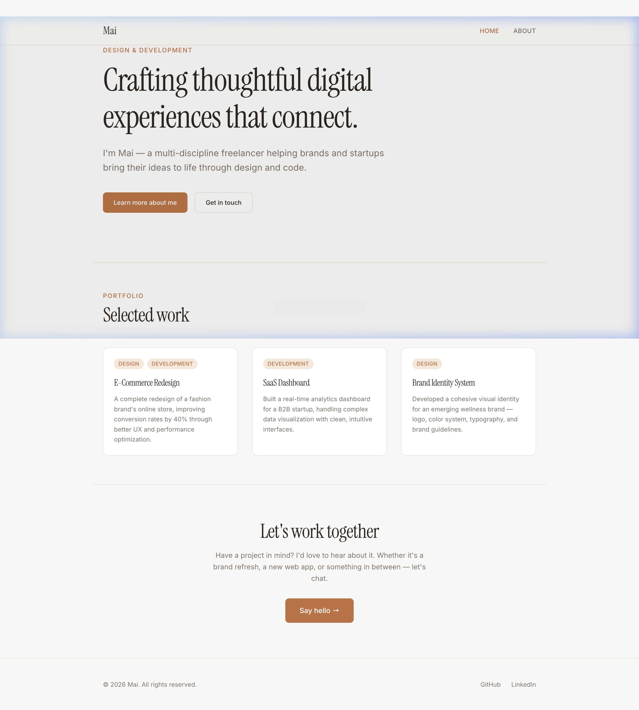
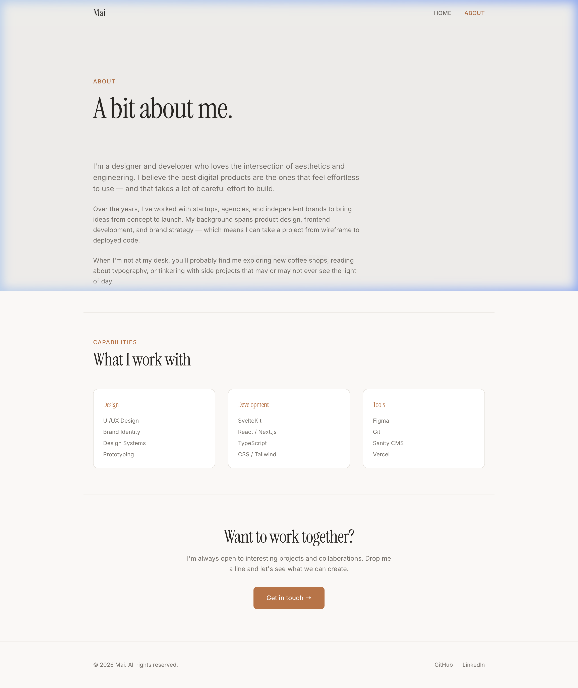

# Phase 1 — Foundation Walkthrough

## Summary

All Phase 1 items from `SPEC.md` have been implemented and verified. The site now has a containerized dev environment, TailwindCSS v4 with warm design tokens, two fully styled pages, and is ready for Vercel deployment.

---

## What Changed

### Docker Dev Environment
- **Removed** `.devcontainer/` (replaced by spec's Docker approach)
- **Added** `Dockerfile.dev` — minimal `node:22-alpine` with `npm ci`
- **Added** `docker-compose.yml` — bind-mounts source, anonymous volume for `node_modules`, port 5173
- **Added** `.env.example` and `.env` — Sanity placeholder vars
- **Added** `.dockerignore` — excludes build artifacts from Docker context

### TailwindCSS v4
- **Updated** `vite.config.js` — added `@tailwindcss/vite` plugin
- **Rewrote** `app.css` — CSS-first Tailwind v4 config with `@theme` design tokens:
  - Warm color palette: cream bg (`#faf8f5`), terracotta accent (`#c2703e`), charcoal text (`#2c2825`)
  - Typography: **Instrument Serif** for headings, **Inter** for body
  - Fluid type scale using `clamp()`

### Components (all Svelte 5 runes)
- **Header** — Sticky nav with active link highlighting via `$page.url.pathname`, animated mobile hamburger
- **Footer** — Minimal: copyright + social links
- **SEO** — `<svelte:head>` wrapper with title, description, OG tags, Twitter Card, canonical URL

### Pages
- **Home (`/`)** — Hero section with tagline + CTA buttons, 3-column selected work grid, "Let's work together" CTA
- **About (`/about`)** — Personal story, 3-column skills/capabilities grid, CTA

### Vercel Adapter
- Swapped `adapter-auto` → `adapter-vercel`
- Build-time only — confirmed no conflict with container dev workflow

---

## Results

### Home Page


### About Page


---

## Verification

| Check | Result |
|-------|--------|
| `docker compose build` | ✅ Image builds successfully |
| `docker compose up` | ✅ Vite dev server starts on port 5173 |
| HMR | ✅ File changes reflected instantly (confirmed via Vite logs) |
| Home page renders | ✅ Hero, selected work, CTA all visible |
| About page renders | ✅ Story, skills grid, CTA all visible |
| Active nav link | ✅ Current page highlighted in header |
| `npm run build` (in container) | ✅ Builds with `adapter-vercel`, output in `.svelte-kit/output` |

---

## How to Run

```bash
# Start dev server
docker compose up --build

# Visit in browser
open http://localhost:5173

# Run production build (inside container)
docker compose exec app npm run build
```
